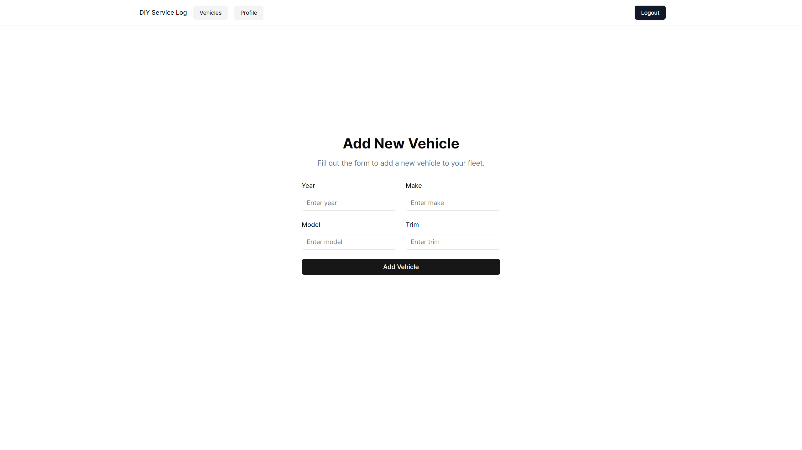
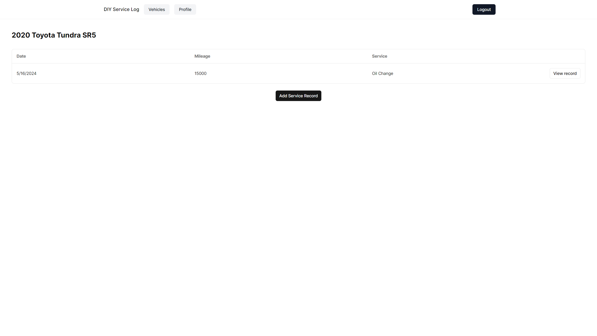
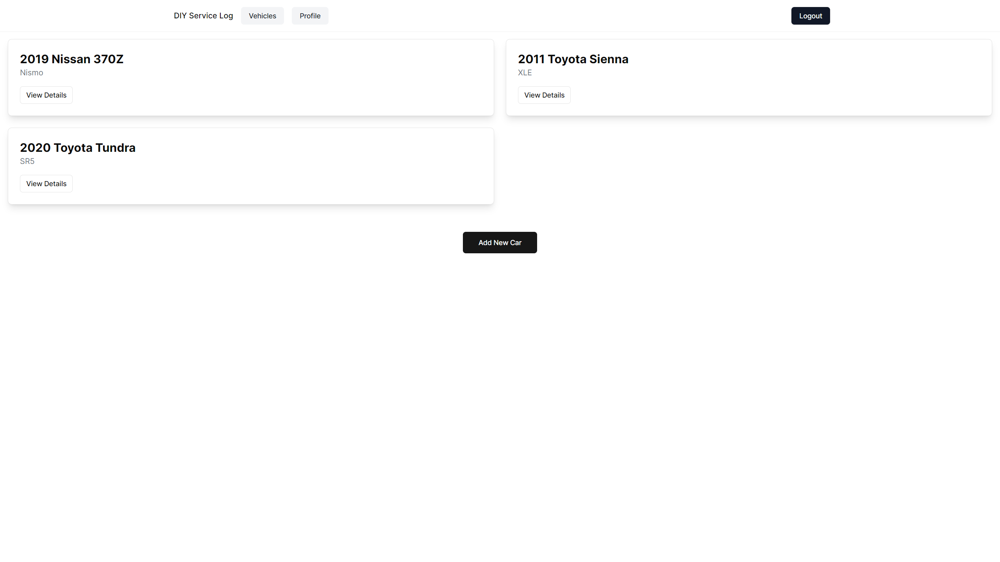
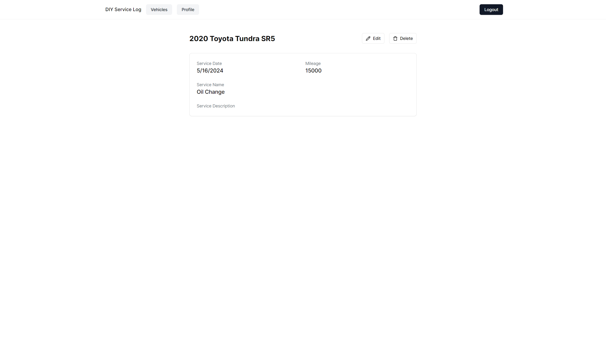

## About

DIY Service Log is a full stack application for car enthusiasts to track their vehicle maintenance records. Currently, the application supports user signup/login, adding/multiple vehicles per user, CRUD maintenance records.

## Getting Started

This project is still under development.

To get started you will need to host your own Pocketbase backend. Included in this repository setup folder is pb_schema.json which you can import into pocketbase to create the necessary tables for this application.

Within the .\diy-service-log\src\lib\pocketbase.ts file, please point line 3 to your pocketbase api:

const pb = new PocketBase('#');

Once pocketbase is running, you can run this application like any other Next.js application.

## Screenshots

### Add a New Vehicle

### Home

### Maintenance Records

### User Vehicles

### Record Details
